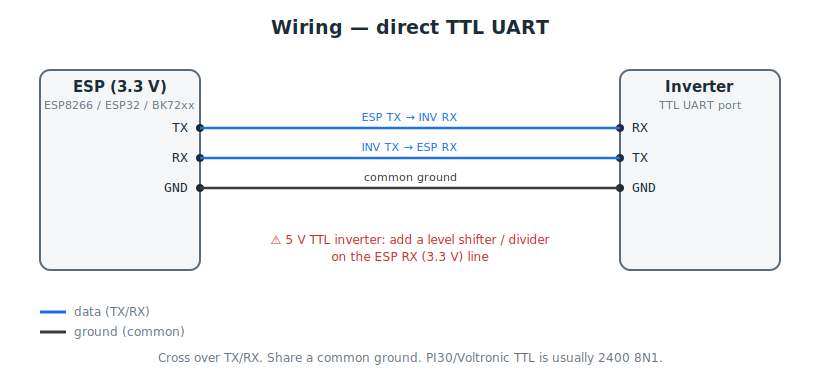
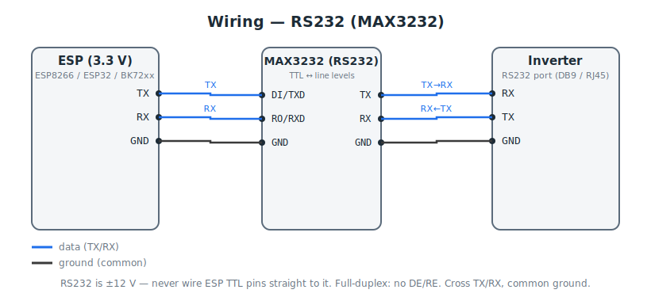
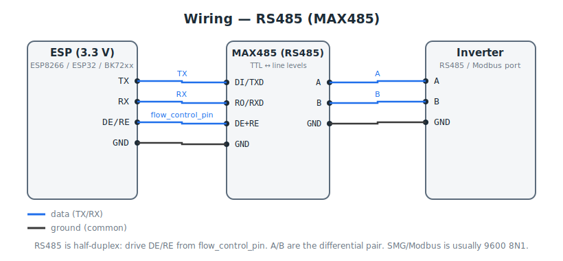

# ESP EyeBond Collector

[](https://esphome.io/components/external_components.html)
[](https://www.mozilla.org/en-US/MPL/2.0/)

[Українською](README.uk.md)

**ESP EyeBond Collector** is ESPHome firmware for connecting a hybrid inverter to Home Assistant without a factory SmartESS / EyeBond Wi-Fi collector.

It turns an ESP8266, ESP32, or supported BK72xx board into a local collector bridge for [EyeBond Local](https://github.com/groove-max/ha-eybond-local).

Use it when:

- your inverter has no factory SmartESS / EyeBond collector;
- the factory collector is unavailable or unreliable;
- you want a local-only bridge between the inverter and Home Assistant.

The bridge stays on your LAN and does not connect to SmartESS cloud.

> **First release status:** PI30 / Voltronic-style ASCII communication has been validated on real hardware. SMG / Modbus-style communication uses the same bridge path and is available for testing, but needs more real-device reports.

---

## What you get

- Local connection from inverter to Home Assistant through EyeBond Local.
- Normal EyeBond Local setup: scan, detect, add collector + inverter devices.
- Sensors and controls provided by the Home Assistant integration for your inverter model.
- ESPHome features: OTA updates, logs, captive portal, and optional ESPHome entities.
- Wi-Fi management from EyeBond Local where supported.
- Optional runtime UART baud-rate select on ESP8266/ESP32 when you add the board through the ESPHome integration.
- Built-in status LED indication on the release presets, with an optional `com_led_pin` for a separate inverter-communication LED.

What you do **not** get:

- SmartESS cloud access through this bridge.
- SmartESS app monitoring for this bridge.
- EyeBond Local cloud-only features such as device learning or proxy capture.

---

## What you need

| Inverter port | Hardware needed |
|---|---|
| TTL UART | Direct UART wiring. Use a level shifter or divider on ESP RX if the inverter uses 5 V TTL. |
| RS232 | MAX3232 RS232↔TTL converter. Do not connect ESP pins directly to RS232. |
| RS485 | MAX485 / MAX3485 RS485 transceiver. Classic modules need one GPIO for DE/RE direction control. |

Supported boards:

- ESP8266 with 4 MB flash, for example Wemos D1 mini class boards.
- Common ESP32 boards.
- BK72xx boards through ESPHome LibreTiny.

You also need ESPHome, either from the Home Assistant ESPHome add-on or the ESPHome CLI.

> **Important:** while this bridge is connected, no other device should poll the inverter on the same serial line. One inverter bus should have one active master.

---

## Wiring

Pick the diagram that matches the inverter port.

### TTL UART

Use this for many PI30 / Voltronic-style ports.



### RS232

Use a MAX3232 converter for DB9/RJ45 RS232 ports.



### RS485

Use this for SMG / Modbus-style A/B ports.



General rules:

- Cross TX/RX for TTL and RS232.
- Share ground where required by your transceiver.
- For RS485, connect A to A and B to B. If it does not work, try swapping A/B; some hardware labels are reversed.
- Ready-made browser firmware starts at `9600`. PI30 / Voltronic-style inverters commonly use `2400`; SMG / Modbus inverters commonly use `9600`.

---

## Quick start

For a full step-by-step guide, use [Flashing & first setup](docs/FLASHING.md). Ukrainian version: [Прошивка та перше налаштування](docs/FLASHING.uk.md).

Short version:

1. For a standard board, use the browser flasher. For custom pins or development, install ESPHome.
2. Copy an example from [examples/](examples/):
   - [`esp8266-d1-mini.yaml`](examples/esp8266-d1-mini.yaml) — release preset for D1 mini compatible boards
   - [`esp32-devkit.yaml`](examples/esp32-devkit.yaml) — release preset for ESP32 DevKit compatible boards
   - [`esp32-ble.yaml`](examples/esp32-ble.yaml) — advanced ESP32 BLE provisioning profile
   - [`bk72xx.yaml`](examples/bk72xx.yaml) — advanced BK72xx / LibreTiny profile
3. Create `examples/secrets.yaml` with your Wi-Fi name and password.
4. Check the ESP board type and UART pins in the YAML.
5. Flash once over USB.
6. Wire the ESP board to the inverter.
7. Add EyeBond Local in Home Assistant and run the normal collector scan.

Example ESPHome block:

```yaml
external_components:
  - source: github://groove-max/esp-eybond-collector
    components: [eybond_collector]

uart:
  id: inverter_uart
  tx_pin: GPIO13
  rx_pin: GPIO12
  baud_rate: 9600

eybond_collector:
  id: bridge
  uart_id: inverter_uart
  flow_control_pin: GPIO14  # connect only for RS485; leave unconnected for TTL/RS232
```

Optional ESPHome baud-rate select for ESP8266/ESP32:

```yaml
select:
  - platform: eybond_collector
    eybond_collector_id: bridge
    name: "Inverter UART baud rate"
    restore_value: true
```

The normal way to change speed is in EyeBond Local: open the ESP bridge collector **Configure** menu, choose **Change inverter UART speed**, select the speed, and confirm. On ESP8266/ESP32, the selected speed is saved and restored after reboot or power loss. The inverter connection may drop briefly while the speed changes.

This ESPHome select appears under the ESPHome device in Home Assistant. It is useful for diagnostics, but normal users should prefer the EyeBond Local action.

On BK72xx / LibreTiny, change `baud_rate:` in YAML and reflash instead. A reboot alone is not enough because LibreTiny initializes UART from the compiled YAML value.

Release presets use one pinout for all physical links:

| Preset | TX | RX | DE/RE for RS485 | Status LED | Default UART speed |
|---|---|---|---|---|---|
| ESP8266 D1 mini | GPIO13 / D7 | GPIO12 / D6 | GPIO14 / D5 | GPIO2 / D4, inverted | `9600` |
| ESP32 DevKit | GPIO17 | GPIO16 | GPIO4 | GPIO2 | `9600` |

For TTL and RS232, use TX/RX/GND and leave the DE/RE pin unconnected. For RS485, connect DE and RE together to the listed DE/RE pin.

The onboard LED in the table is `status_led_pin`; on a single LED it shows both connection state and an inverter-communication flicker. Add an optional `com_led_pin` for a dedicated communication LED — see [Status and COM LEDs](docs/FLASHING.md#status-and-com-leds).

---

## Adding it to Home Assistant

1. Install [EyeBond Local](https://github.com/groove-max/ha-eybond-local).
2. Power the ESP bridge and make sure it is on Wi-Fi.
3. Open **Settings → Devices & Services → Add Integration → EyeBond Local**.
4. Use the normal collector network setup.
5. The bridge should be found like a collector.
6. EyeBond Local then talks through the bridge to detect the inverter.

Keep Home Assistant and the bridge on the same local network for easiest discovery.

After setup, Home Assistant may show two relevant devices:

- the EyeBond Local collector/inverter devices;
- the ESPHome device for firmware-level features such as logs, OTA, and optional baud-rate select.

For the custom ESP bridge, EyeBond Local also exposes **Change inverter UART speed** in the collector **Configure** menu. Use it when the bridge is found but the inverter needs another serial speed. On ESP8266/ESP32, the selected speed is saved and restored after reboot or power loss.

---

## Wi-Fi changes

The bridge can use normal ESPHome Wi-Fi setup and captive portal behavior. When it opens the setup portal, its temporary Wi-Fi network is named like its virtual collector PN, for example `V00000...`.

EyeBond Local can also change collector Wi-Fi settings for the bridge. If the new credentials are wrong, the bridge should fall back to its setup portal instead of becoming permanently unreachable.

The nearby-network list can show only the current network on the first read. Refresh after a few seconds to see the full scan result.

---

## Safety model

- The bridge does not create inverter commands by itself.
- It forwards commands from EyeBond Local to the inverter and returns the inverter response.
- If the inverter is silent, the bridge reports silence instead of inventing data.
- The bridge is local-only and does not connect to SmartESS cloud.
- Cloud-only EyeBond Local actions are not applicable to this bridge.

---

## Troubleshooting

| Problem | Try this |
|---|---|
| EyeBond Local does not find the bridge | Check that the ESP board is online, on the same network as Home Assistant, and reachable from Home Assistant. |
| The bridge is found, but the inverter is not detected | Check UART pins, TX/RX direction, common ground, baud rate, and transceiver type. This is the most common setup problem. |
| ESPHome logs show transmit but no receive | The inverter reply path is wrong: RX pin, wiring, level converter, RS485 A/B, or baud rate. |
| Random or unreadable serial data | Usually wrong baud rate or wrong voltage/level conversion. |
| Sensors disappear later | Check inverter power, serial cable, ESP Wi-Fi, and whether the bridge fell back to the setup portal after a Wi-Fi change. |
| Need another UART speed | In EyeBond Local, open the ESP bridge collector **Configure** menu and use **Change inverter UART speed**. |
| Wi-Fi change failed | Connect to the bridge setup Wi-Fi network named like `V00000...` and enter correct Wi-Fi credentials again. |

If EyeBond Local detects the bridge but the inverter still does not work, create a Support Archive from EyeBond Local and attach it to an issue.

---

## Documentation

- [Documentation index](docs/README.md)
- [Flashing & first setup](docs/FLASHING.md), including browser flashing
- [Прошивка та перше налаштування](docs/FLASHING.uk.md)
- [Contributing](CONTRIBUTING.md)
- Wiring diagrams: [TTL](docs/images/wiring-ttl.svg), [RS232](docs/images/wiring-rs232.svg), [RS485](docs/images/wiring-rs485.svg)

---

## License

Licensed under [MPL-2.0](LICENSE).
